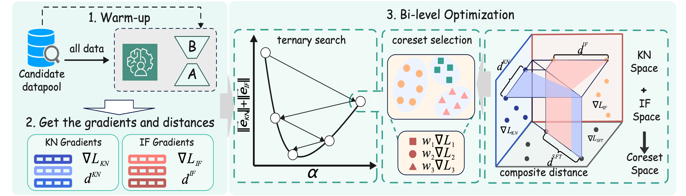

# 🎯 BRIEF: Bi-level Coreset Selection for Efficient Instruction Tuning in LLMs

<div align="center">



[](https://www.python.org/downloads/)
[](LICENSE)

*🔬 A novel bi-level optimization framework for efficient coreset selection in Large Language Model instruction tuning*

</div>

## 📋 Overview

**BRIEF** addresses the challenge of efficient instruction tuning by selecting high-quality subsets (coresets) of instruction examples that maintain model performance while significantly reducing training costs. Our approach makes three key contributions:

**🔬 Theoretical Foundation**: We prove that SFT loss naturally decomposes into two fundamental components:
- 🧠 **Knowledge-related capability** (KN): Real-world knowledge generation
- 📝 **Instruction following capability** (IF): Task instruction execution

**🎯 Novel Optimization Objective**: Unlike traditional coreset methods that minimize the overall gradient approximation error, we propose minimizing the sum of individual KN and IF gradient errors to preserve both capabilities simultaneously.

**🛠️ Bi-level Optimization Framework**: We design an efficient algorithm that solves this reformulated optimization problem through ternary search and submodular maximization, achieving **3× training speedup** and **5% accuracy improvement**.

## ⚡ Key Features

- 🎯 **Dual-capability preservation**: Maintains both knowledge and instruction-following abilities
- 🚀 **3× computational reduction**: Significant training efficiency improvements
- 🔬 **Theoretical foundation**: Mathematically proven gradient approximation bounds
- 🛠️ **Bi-level optimization**: Efficient solution with provable guarantees

## 🏗️ Architecture

Our framework operates through a sophisticated bi-level optimization process:

1. **🔥 Warm-up Phase**: Initial model training on sampled data
2. **📊 Gradient Extraction**: Decompose gradients into KN and IF components  
3. **🎯 Bi-level Optimization**: 
   - *Upper level*: Ternary search for optimal solution space partitioning (α)
   - *Lower level*: Submodular maximization for coreset selection
4. **🎓 Final Training**: Train on selected coreset with full efficiency

## 🚀 Quick Start

### Prerequisites

```bash
# Install dependencies
pip install -r requirements.txt

# Ensure GPU availability
nvidia-smi
```

### 🔧 Configuration

Edit `script/default_config.sh` to set your paths and parameters:

```bash
# Model and data paths
MODEL_TRAIN_PATH="../cache/Llama3-8B-Base"
DATA_FILE="./data/tulu3_mix.jsonl"

# Training parameters  
MAX_LENGTH=2048
PROPORTIONS="0.05"  # 5% coreset size
```

### 📝 Usage Pipeline

Execute the complete BRIEF pipeline with these four steps:

```bash
# Step 1: 🔥 Warm-up training (5% sample)
bash script/step1_warm_up.sh script/default_config.sh

# Step 2: 📊 Extract gradients for KN/IF decomposition  
bash script/step2_get_gradients.sh script/default_config.sh

# Step 3: 🎯 BRIEF coreset selection with bi-level optimization
bash script/step3_BRIEF.sh script/default_config.sh

# Step 4: 🎓 Final training on selected coreset
bash script/step4_train.sh script/default_config.sh
```

### ⚙️ Advanced Configuration

Customize BRIEF selection parameters in `default_config.sh`:

```bash
# Bi-level optimization settings
ENABLE_AUTO_SEARCH="true"      # Automatic α (partitioning parameter) search
SEARCH_PRECISION="0.005"       # Search precision threshold
MAX_ITERATIONS="15"            # Maximum search iterations

# Computational settings
DEVICE="cpu"                   # or "cuda" for GPU acceleration
BATCH_SIZE=32                  # Processing batch size
GRAD_TYPE="unormalized"        # Gradient normalization type
```

## 📁 Project Structure

```
BRIEF/
├── 📜 script/                    # 🎯 Main execution scripts
│   ├── default_config.sh        # ⚙️ Configuration settings
│   ├── step1_warm_up.sh         # 🔥 Warm-up training
│   ├── step2_get_gradients.sh   # 📊 Gradient extraction  
│   ├── step3_BRIEF.sh          # 🎯 Coreset selection
│   └── step4_train.sh          # 🎓 Final training
├── 🧮 brief/                    # Core implementation
│   ├── coreset/                # 🎯 BRIEF algorithm
│   ├── get_grads/             # 📊 Gradient computation
│   └── train/                 # 🎓 Training modules
├── 🛠️ tools/                   # Utility scripts
├── 🖼️ framework.png            # Architecture visualization
└── 📋 requirements.txt         # Dependencies
```

## 🔬 Theoretical Foundation

### Mathematical Decomposition

BRIEF is built on the theoretical insight that SFT loss naturally decomposes:

```
L_SFT = L_KN + L_IF
```

Where:
- `L_KN`: Knowledge-related loss component
- `L_IF`: Instruction following loss component

### Optimization Objective  

Unlike traditional methods minimizing `||E_{L_SFT}||`, BRIEF optimizes:

```
min Σ(||E_{L_KN}|| + ||E_{L_IF}||)
```

This ensures both capabilities are simultaneously preserved with bounded approximation error.


## 📜 License

This project is licensed under the MIT License - see the [LICENSE](LICENSE) file for details.


---